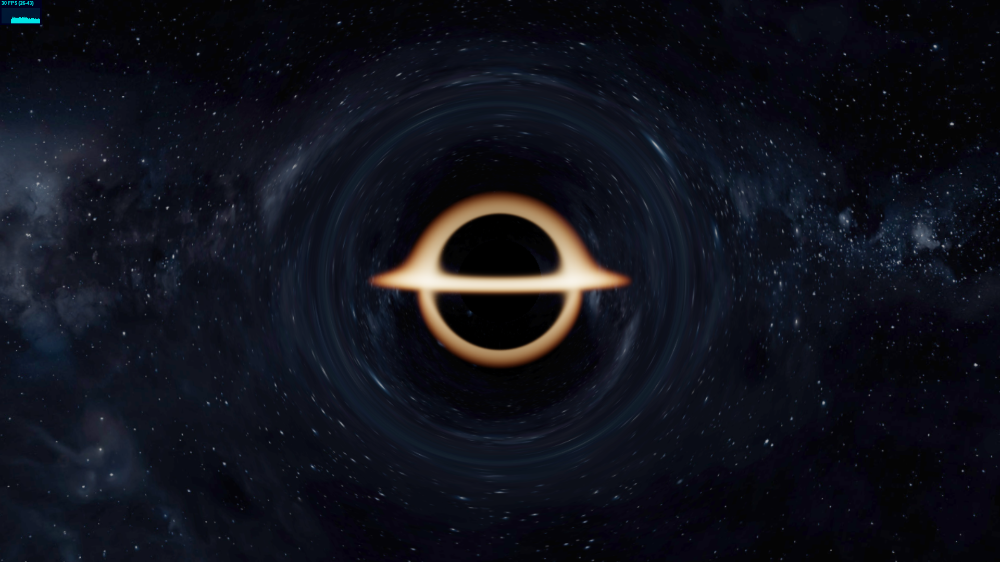
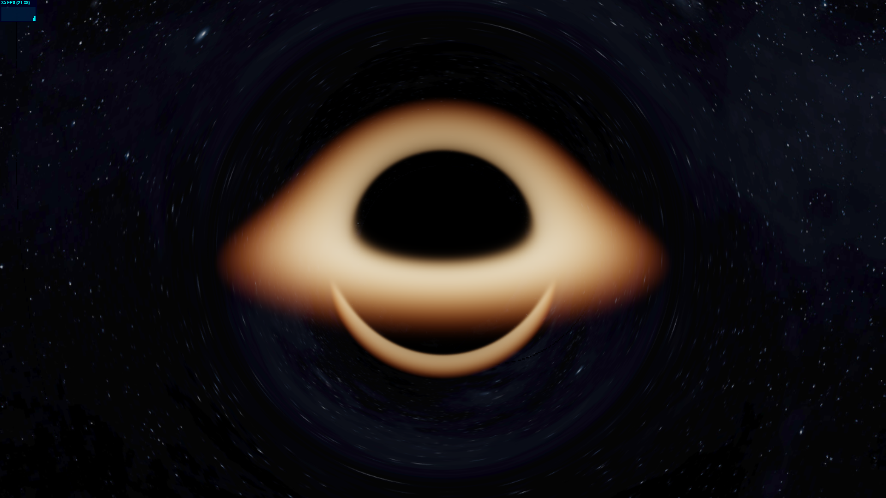
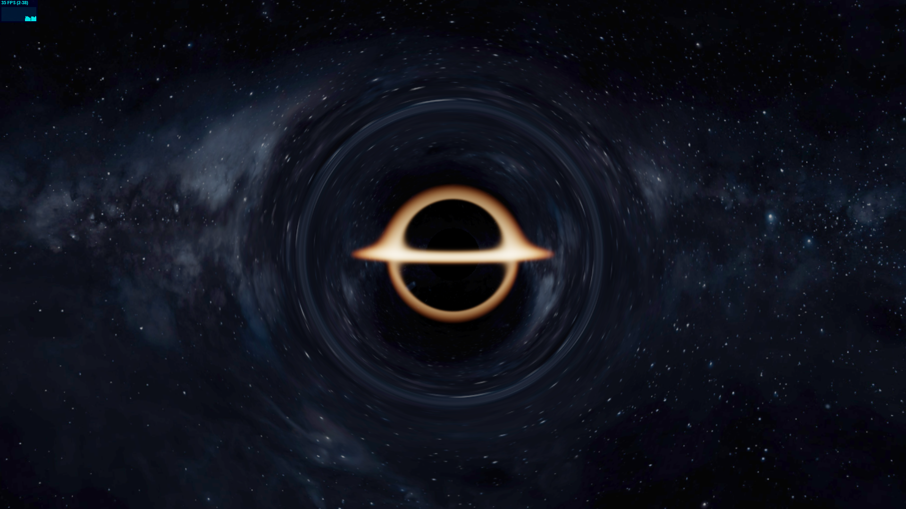
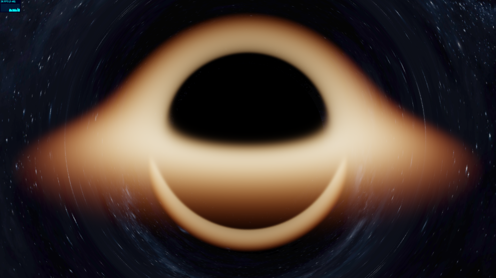

# Black Hole Simulation

Simulazione interattiva in tempo reale di un buco nero sviluppata con **Three.js**, **Electron** e **GLSL Shaders**, progettata per offrire effetti visivi avanzati di lente gravitazionale e un disco di accrescimento mantenendo prestazioni elevate (60 FPS stabili).

---

## Caratteristiche Principali

* **Ray-Marching in GLSL:** Shader personalizzato per il calcolo della curvatura dello spaziotempo, della sfera fotonica e del disco di accrescimento.
* **Upscaling Spaziale Dinamico:** Utilizzo di un `WebGLRenderTarget` a risoluzione ridotta con filtro lineare e passaggio di post-processing per allegre il carico di calcolo della GPU senza perdita visiva percepibile.
* **Decadimento dei Raggi Dinamico:** Adattamento automatico dei passi di campionamento e della distanza di fuga in base alla posizione della telecamera (`u_camDist`), per una resa nitida sia da vicino che da grande distanza.
* **Controllo della Camera & Auto-Rotazione:** Integrazione con `OrbitControls` (con smorzamento) e rotazione automatica inattiva quando l'utente non interagisce.
* **Ottimizzazione del Rendering:** Gestione condizionale dei fotogrammi (`requestRender()`) per evitare consumi superflui di risorse quando la scena è statica.

---

## Tecnologie Utilizzate

* **JavaScript (ES6+)**
* **Three.js** (Gestione della scena, camere, renderer e materiali)
* **Electron** (Contenitore desktop dell'applicazione)
* **GLSL** (Linguaggio di shading per il motore di ray-marching)

---

## Anteprime della Simulazione

